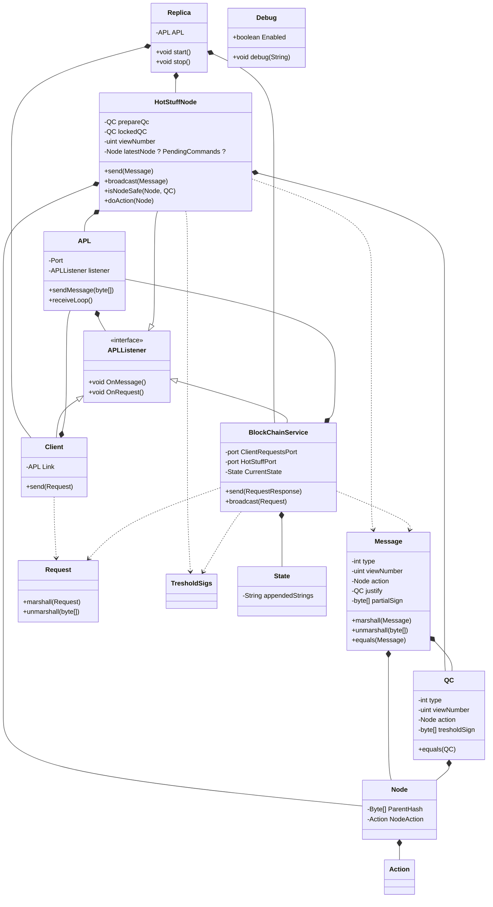
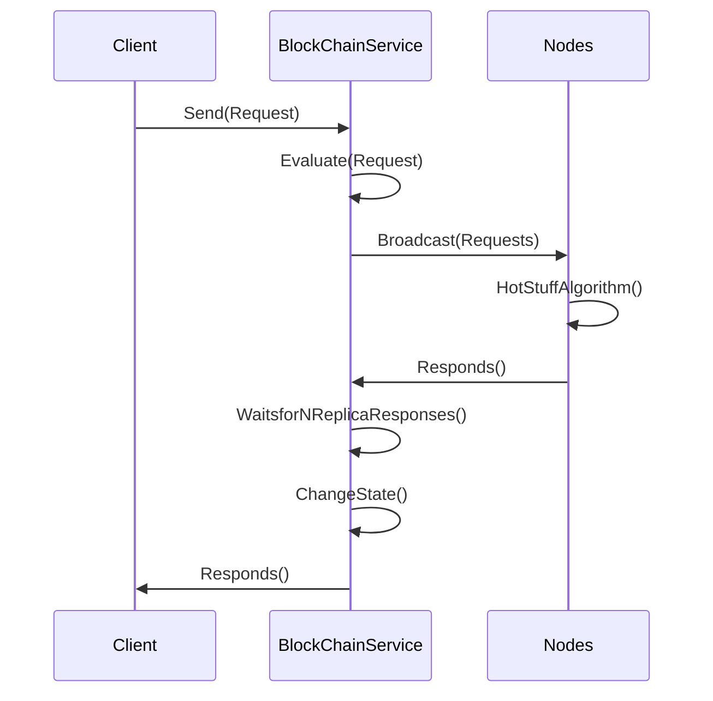
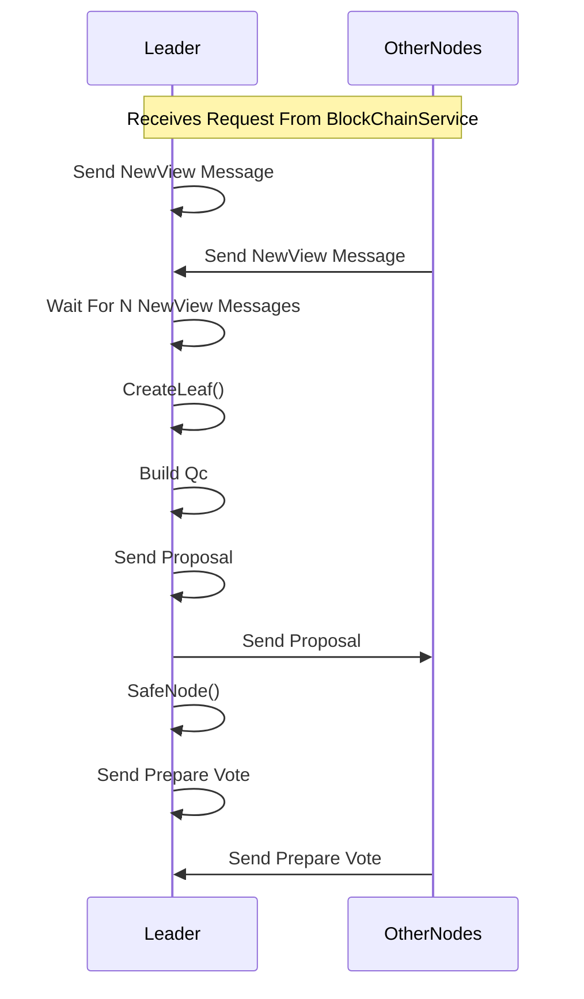
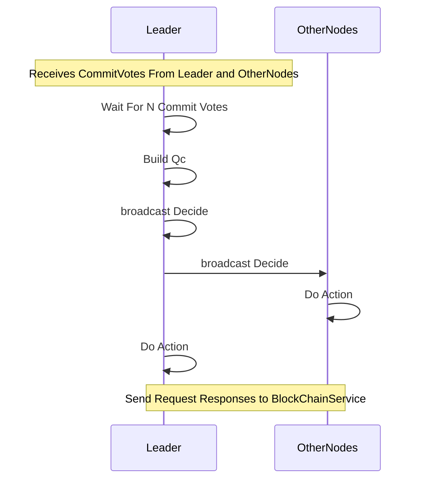

# Class Diagram

```mermaid
classDiagram

class Message{
    -int type
    -uint viewNumber
    -Node action
    -QC justify
    -byte[] partialSign

    +marshall(Message)
    +unmarshall(byte[])
    +equals(Message)
}

class Request{

    +marshall(Request)
    +unmarshall(byte[])
}

class QC {
    -int type
    -uint viewNumber
    -Node action
    -byte[] tresholdSign

    +equals(QC)
}

class Replica{
    -APL APL
    +void start()
    +void stop()
}

class HotStuffNode{
    -QC prepareQc
    -QC lockedQC
    -uint viewNumber
    -Node latestNode ? PendingCommands ?

    +send(Message)
    +broadcast(Message)
    +isNodeSafe(Node, QC)
    +doAction(Node)
}

class APL{
    -Port
    -APLListener listener
    +sendMessage(byte[])
    +receiveLoop()
}

class TresholdSigs {
}

class Client{
    -APL Link

    +send(Request)
}

class Debug{
    +boolean Enabled

    +void debug(String)
}

class BlockChainService{
    -port ClientRequestsPort
    -port HotStuffPort
    -State CurrentState

    +send(RequestResponse)
    +broadcast(Request)
} 

class State {
    -String appendedStrings
}
class Node{
    -Byte[] ParentHash
    -Action NodeAction
}

class Action{
}

class APLListener {
    <<interface>>
    +void OnMessage()
    +void OnRequest()
}

Replica *-- HotStuffNode
Replica *-- Client
Replica *-- BlockChainService
BlockChainService *-- State

HotStuffNode ..> Message
HotStuffNode ..> TresholdSigs
BlockChainService ..> TresholdSigs
Client ..> Request

BlockChainService ..> Message
BlockChainService ..> Request

HotStuffNode *-- APL
HotStuffNode *-- Node
HotStuffNode *-- QC

Client *-- APL
BlockChainService *-- APL
APL *-- APLListener

Message *-- Node
QC *-- Node

Message *-- QC

Node *-- Action

APLListener <|-- Client
APLListener <|-- HotStuffNode
APLListener <|-- BlockChainService

```

# Sequence Diagram

## Overview Sequence Diagram

```mermaid
sequenceDiagram

Client ->> BlockChainService : Send(Request)
BlockChainService ->> BlockChainService : Evaluate(Request)
BlockChainService ->> Nodes : Broadcast(Requests)
Nodes ->> Nodes : HotStuffAlgorithm()
Nodes ->> BlockChainService : Responds()
BlockChainService ->> BlockChainService : WaitsforNReplicaResponses()
BlockChainService ->> BlockChainService : ChangeState()
BlockChainService ->> Client : Responds()
```

## Prepare Sequence Diagram

```mermaid
sequenceDiagram
Note over Leader,OtherNodes: Receives Request From BlockChainService
Leader ->> Leader : Send NewView Message 
OtherNodes ->> Leader : Send  NewView Message
Leader ->> Leader : Wait For N NewView Messages
Leader ->> Leader : CreateLeaf()
Leader ->> Leader : Build Qc
Leader ->> Leader : Send Proposal
Leader ->> OtherNodes : Send Proposal
Leader ->> Leader : SafeNode()
Leader ->> Leader : Send Prepare Vote
OtherNodes ->> Leader : Send Prepare Vote

```

## Commit Sequence Diagram

```mermaid
sequenceDiagram
Note over Leader: Receives CommitVotes From Leader and OtherNodes
Leader ->> Leader : Wait For N Commit Votes
Leader ->> Leader : Build Qc
Leader ->> Leader : broadcast Decide
Leader ->> OtherNodes : broadcast Decide
OtherNodes->>OtherNodes : Do Action
Leader ->> Leader : Do Action
Note over Leader, OtherNodes: Send Request Responses to BlockChainService
```